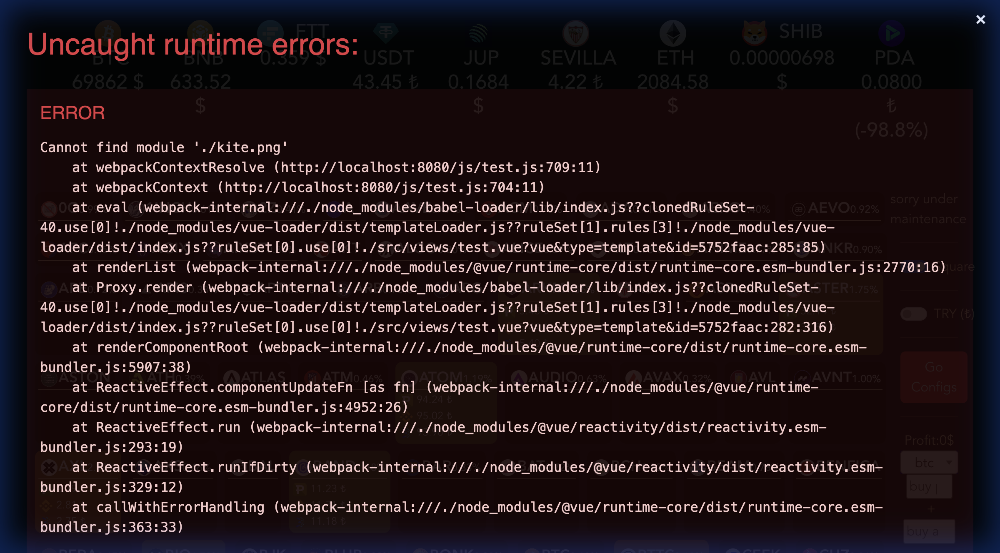

# VueCoin

Cryptocurrency arbitrage monitoring dashboard tracking prices across **Paribu**, **Binance**, **BTCTurk**, and **Chiliz**.



## Project Structure

This is a monorepo containing both the backend API and the frontend Vue application:

- **`/` (Root)**: Express.js Backend API
  - Runs on port `3000`
  - Aggregates data from exchanges
  - Caches data in Redis

- **`/client`**: Vue 3 Frontend
  - Runs on port `8080`
  - Displays real-time dashboard

## Getting Started

### 1. Start Backend
```bash
npm install
npm run dev
# Server running at http://localhost:3000
```

### 2. Start Frontend
```bash
cd client
npm install
npm run serve
# Frontend running at http://localhost:8080
```